# Banking Incident Management System - CrewAI

A multi-agent AI system for comprehensive banking incident analysis, triage, and resolution planning.

---

## Table of Contents
1. [Environment Details](#environment-details)
2. [Problem Being Solved](#problem-being-solved)
3. [System Architecture](#system-architecture)
4. [Alternative Approaches Explored](#alternative-approaches-explored)
5. [Getting Started](#getting-started)
6. [Usage](#usage)

---

## Environment Details

### System Requirements

| Requirement | Details |
|-------------|---------|
| **Operating System** | Windows 10/11, macOS, Linux |
| **Python Version** | 3.9, 3.10, or 3.11 |
| **Architecture** | x86_64 (Intel/AMD) |
| **Memory** | 4GB minimum, 8GB recommended |
| **Internet** | Required for OpenAI API calls |

### Dependencies

| Package | Version | Purpose |
|---------|---------|---------|
| `crewai` | >=0.28.0 | Multi-agent orchestration framework |
| `openai` | >=1.0.0 | OpenAI API client library |
| `python-dotenv` | >=1.0.0 | Environment variable management |

### Installation Steps

```bash
# 1. Navigate to project folder
cd crewai-banking-inc-mgmt

# 2. Create virtual environment
python -m venv venv

# 3. Activate environment
# Windows:
venv\Scripts\activate
# macOS/Linux:
source venv/bin/activate

# 4. Install dependencies
pip install crewai openai python-dotenv
```

### Key APIs & External Services

| Service | Purpose | Authentication | Version |
|---------|---------|-----------------|---------|
| OpenAI GPT-4o-mini | LLM for agent reasoning | API Key (.env) | Latest |
| OpenAI API | Model invocation | HTTPS/TLS | v1 |
| Environment Variables | Secure config management | `.env` file | N/A |
| Python Standard Library | Core functionality | Built-in | 3.9+ |

### Development Environment

| Component | Recommendation | Notes |
|-----------|---|---|
| **IDE** | VS Code | With Python extension |
| **Python Interpreter** | Virtual environment (venv) | Isolated dependencies |
| **Version Control** | Git | For repository management |
| **Shell** | PowerShell (Windows) / Bash (Unix) | Command execution |
| **Terminal** | Integrated terminal in VS Code | Convenience |

---

## Problem Being Solved

### Context
Banking platforms handle millions of transactions daily across multiple channels (mobile, web, ATM). When incidents occur, they require rapid, coordinated response from multiple specialized teams:
- **Support teams** must understand customer impact
- **Infrastructure teams** must diagnose system/network issues
- **Backend teams** must identify code-level problems
- **Fraud teams** must assess security implications
- **QA teams** must create test plans
- **Communications teams** must manage customer expectations
- **Engineering leadership** must coordinate resolution

### Challenges Without This System

**1. Fragmented Communication**
- Each team works in silos (support tickets, Slack, separate tools)
- No unified view of incident
- Information loss between handoffs

**2. Slow Root Cause Analysis (RCA)**
- Sequential investigation (support → ops → backend)
- Parallel experts can't influence each other's analysis
- No structured reasoning framework

**3. Inconsistent Incident Triage**
- Subjective severity assessment
- Missed regulatory compliance requirements
- No systematic pattern recognition

**4. Delayed Resolution Planning**
- Action plans created after full RCA
- Engineering coordination ad-hoc
- Testing/validation plans developed late

**5. Poor Post-Incident Learning**
- Limited documentation of reasoning
- Difficult to extract patterns
- No structured postmortem templates

### Solution: Multi-Agent Orchestration

This system addresses these challenges by:

1. **Parallel Expertise**: 7 specialized agents analyze simultaneously
   - Each agent has domain expertise (SRE, backend, fraud, QA, comms)
   - Agents share context via a central knowledge base (ORG_CONTEXT)

2. **Structured Reasoning**: Sequential task execution ensures logical flow
   - Context assessment → Support analysis → Infrastructure investigation
   - Backend analysis → QA planning → Communications → Engineering action plan

3. **Comprehensive Output**: Single report covering all perspectives
   - Risk assessments + customer impact
   - Infrastructure RCA + backend fixes
   - Test plans + communication templates
   - Engineering action plan with compliance notes

4. **Regulatory Compliance**: Banking-specific constraints
   - Considers compliance implications at each stage
   - Generates regulatory reporting templates
   - Ensures proper documentation for audits

---

## System Architecture

### High-Level Architecture

```mermaid
graph TD
    A["🎯 INPUT LAYER"] --> B["📊 ORCHESTRATION LAYER"]
    
    A1["👥 Customer Complaints"] -.-> A
    A2["📋 Org Context<br/>Stack & SLAs"] -.-> A
    A3["📈 Recent Changes<br/>& Incidents"] -.-> A
    
    B --> C["⚙️ AGENT LAYER<br/>7 Specialized Agents"]
    
    B1["Sequential Task Execution"] -.-> B
    B2["Task 0 → Task 1 → Task 2..6 → Task 7"] -.-> B
    
    C --> C1["🔍 Triage Lead"]
    C --> C2["💬 Support Analyst"]
    C --> C3["🖥️ SRE/Infra Analyst"]
    C --> C4["💾 Backend Analyst"]
    C --> C5["✅ QA Lead"]
    C --> C6["📢 Communications Mgr"]
    C --> C7["📋 Engineering Tech Lead"]
    
    C1 --> D["🤖 LLM LAYER"]
    C2 --> D
    C3 --> D
    C4 --> D
    C5 --> D
    C6 --> D
    C7 --> D
    
    D --> E["🔑 OpenAI GPT-4o-mini<br/>Cost-Effective LLM"]
    
    E --> F["📤 OUTPUT LAYER"]
    
    F --> O1["📊 Risk Analysis"]
    F --> O2["🔧 RCA Reports"]
    F --> O3["🧪 Test Plans"]
    F --> O4["📧 Communications"]
    F --> O5["📋 Action Plan"]
    F --> O6["📝 Postmortem"]
    
    style A fill:#e1f5ff
    style B fill:#f3e5f5
    style C fill:#fff3e0
    style D fill:#e8f5e9
    style F fill:#fce4ec
```



### Detailed Module Interactions


### Data Flow in Sequential Execution

```mermaid
graph TD
    T0["<b>Task 0: Context Risk Assessment</b><br/>Agent: Triage Lead<br/>Input: ORG_CONTEXT<br/>Output: Risk hypotheses + metrics"]
    
    T1["<b>Task 1: Support Analysis</b><br/>Agent: Support Analyst<br/>Input: Complaints + ORG_CONTEXT<br/>Output: Incident buckets + severity"]
    
    T2["<b>Task 2: Infrastructure Investigation</b><br/>Agent: SRE/Infra Analyst<br/>Input: Incident buckets<br/>Output: Infra RCA + mitigations"]
    
    T3["<b>Task 3: Backend Investigation</b><br/>Agent: Backend Analyst<br/>Input: Incident buckets<br/>Output: Backend RCA + code fixes"]
    
    T4["<b>Task 4: QA Planning</b><br/>Agent: QA Lead<br/>Input: Incidents + RCA outputs<br/>Output: Test plans + acceptance criteria"]
    
    T5["<b>Task 5: Communications</b><br/>Agent: Communications Manager<br/>Input: Severity + customer impact<br/>Output: Status updates + templates"]
    
    T6["<b>Task 6: Engineering Action Plan</b><br/>Agent: Tech Lead<br/>Input: ALL previous outputs<br/>Output: Prioritized action plan + tickets"]
    
    T0 --> T1
    T1 --> T2
    T1 --> T3
    T2 --> T4
    T3 --> T4
    T4 --> T5
    T5 --> T6
    
    T6 --> FINAL["📊 FINAL COMPREHENSIVE REPORT"]
    
    style T0 fill:#fff9c4
    style T1 fill:#c8e6c9
    style T2 fill:#b3e5fc
    style T3 fill:#b3e5fc
    style T4 fill:#f8bbd0
    style T5 fill:#ffe0b2
    style T6 fill:#e1bee7
    style FINAL fill:#ffccbc,stroke:#d84315,stroke-width:3px
```



### Key Design Decisions

| Decision | Benefit | Trade-off | Alternative |
|----------|---------|-----------|-------------|
| **Sequential Processing** | Later tasks benefit from earlier analysis | Slower (15-20 min) | Parallel processing |
| **Centralized ORG_CONTEXT** | Single source of truth | Higher token usage | Distributed context |
| **GPT-4o-mini Model** | 90% cheaper than GPT-4 | May miss subtle patterns | GPT-4 Turbo |
| **Environment Variables** | Secure API key storage | Manual .env setup | Cloud secret managers |
| **7-Agent Specialization** | Domain expertise simulation | Added complexity | Single larger agent |
| **Sequential over Hierarchical** | Complete context sharing | Manager overhead avoided | Manager-agent pattern |

---

## Alternative Approaches Explored

### Approach 1: Single Large Language Model (Baseline)

```mermaid
graph LR
    Input["📥 Complaints<br/>+ ORG_CONTEXT"] --> GPT["🔹 GPT-4<br/>Single Mega-Prompt"]
    GPT --> Output["📤 Complete Output<br/>All analyses mixed"]
    
    style Input fill:#fff9c4
    style GPT fill:#ffccbc
    style Output fill:#ffccbc
```



| Aspect | Details |
|--------|---------|
| **Approach** | Single LLM call analyzes all aspects |
| **Pros** | ✅ Simple • Fast • Direct output |
| **Cons** | ❌ Inconsistent quality across domains • Token limit constraints • No domain specialization |
| **Why Not Chosen** | Lacks domain expertise; surface-level analysis unsuitable for banking |

---

### Approach 2: Single Agent with Tool Access

```mermaid
graph LR
    Input["📥 Complaints<br/>+ ORG_CONTEXT"] --> Agent["🤖 Agent with Tools<br/>log_search • metrics_fetch<br/>db_query • compliance_check"]
    Agent --> Output["📤 Complete Analysis"]
    
    style Input fill:#fff9c4
    style Agent fill:#c8e6c9
    style Output fill:#c8e6c9
```



| Aspect | Details |
|--------|---------|
| **Approach** | Single agent with dynamic tool invocation |
| **Pros** | ✅ More flexible • Dynamic tool calls • Good for exploration |
| **Cons** | ❌ Tool hallucination • Sequential calls (slow) • Single perspective • Imbalanced coverage |
| **Why Not Chosen** | Real teams need specialists, not single person with tools |

---

### Approach 3: Hierarchical Multi-Agent

```mermaid
graph TD
    Input["📥 Incident Data"] --> Manager["👨‍💼 Manager Agent<br/>Decides strategy"]
    Manager -->|When needed| SRE["🖥️ SRE Agent"]
    Manager -->|When needed| Backend["💾 Backend Agent"]
    Manager -->|When needed| QA["✅ QA Agent"]
    SRE --> Manager
    Backend --> Manager
    QA --> Manager
    Manager --> Output["📤 Coordinated Output"]
    
    style Input fill:#fff9c4
    style Manager fill:#f8bbd0
    style SRE fill:#b3e5fc
    style Backend fill:#b3e5fc
    style QA fill:#b3e5fc
    style Output fill:#f8bbd0
```



| Aspect | Details |
|--------|---------|
| **Approach** | Manager agent coordinates specialist agents adaptively |
| **Pros** | ✅ Adaptive strategy • Reduced redundancy • Human-like decisions |
| **Cons** | ❌ Extra complexity • Agent skipping risk • Manager reasoning overhead • Hard to debug |
| **Why Not Chosen** | Banking needs ALL perspectives; adaptive selection risks missing analysis |

---

### Approach 4: Pure Parallel Multi-Agent

```mermaid
graph LR
    Input["📥 Complaints<br/>+ ORG_CONTEXT"]
    
    Input --> Agent1["🔍 Triage Lead"]
    Input --> Agent2["💬 Support Analyst"]
    Input --> Agent3["🖥️ SRE Agent"]
    Input --> Agent4["💾 Backend Agent"]
    Input --> Agent5["✅ QA Lead"]
    Input --> Agent6["📢 Comms"]
    Input --> Agent7["📋 Tech Lead"]
    
    Agent1 --> Output["📤 7 Parallel<br/>Outputs"]
    Agent2 --> Output
    Agent3 --> Output
    Agent4 --> Output
    Agent5 --> Output
    Agent6 --> Output
    Agent7 --> Output
    
    style Input fill:#fff9c4
    style Agent1 fill:#c8e6c9
    style Agent2 fill:#c8e6c9
    style Agent3 fill:#b3e5fc
    style Agent4 fill:#b3e5fc
    style Agent5 fill:#f8bbd0
    style Agent6 fill:#ffe0b2
    style Agent7 fill:#e1bee7
    style Output fill:#ffccbc
```



| Aspect | Details |
|--------|---------|
| **Approach** | All agents run simultaneously on same inputs |
| **Pros** | ✅ Maximum speed • All analyses parallel • Scalable |
| **Cons** | ❌ No inter-agent insights • Contradictory outputs • Later teams lack RCA context |
| **Why Not Chosen** | QA and Tech Lead need infrastructure + backend analysis before planning |

---

### Approach 5: Sequential Multi-Agent ⭐ (Current)

```mermaid
graph TD
    T0["⭐ Task 0: Triage Lead<br/>Risk Assessment"]
    T1["⭐ Task 1: Support Analyst<br/>Incident Buckets"]
    T2["⭐ Task 2: SRE/Infra<br/>RCA"]
    T3["⭐ Task 3: Backend<br/>RCA"]
    T4["⭐ Task 4: QA<br/>Test Plans"]
    T5["⭐ Task 5: Communications<br/>Updates"]
    T6["⭐ Task 6: Tech Lead<br/>Action Plan"]
    
    T0 --> T1
    T1 --> T2
    T1 --> T3
    T2 --> T4
    T3 --> T4
    T4 --> T5
    T5 --> T6
    T6 --> Final["🏆 FINAL REPORT<br/>Complete & Comprehensive"]
    
    style T0 fill:#fff9c4
    style T1 fill:#c8e6c9
    style T2 fill:#b3e5fc
    style T3 fill:#b3e5fc
    style T4 fill:#f8bbd0
    style T5 fill:#ffe0b2
    style T6 fill:#e1bee7
    style Final fill:#ffccbc,stroke:#d84315,stroke-width:3px
```



| Aspect | Details |
|--------|---------|
| **Approach** | Chain of agents with output flowing into next inputs |
| **Pros** | ✅ Logical flow • Complete context • Domain expertise • Quality analysis • Deterministic • Clear dependencies |
| **Cons** | ⚠️ Slower (15-20 min) • Error propagation • Higher token usage |
| **Why Chosen** | **Best balance for banking incidents. Quality > Speed. Matches real incident teams.** |

---

### Approach 6: Adaptive Hybrid (Future Enhancement)

```mermaid
graph TD
    Input["📥 Incident Data"] --> Severity{"🎯 Assess<br/>Severity"}
    
    Severity -->|P0/CRITICAL| Full["🔴 Full Pipeline<br/>All 7 tasks<br/>15-20 min"]
    Severity -->|P1/HIGH| Medium["🟠 Medium Pipeline<br/>Tasks 1-6<br/>8-10 min"]
    Severity -->|P2/MEDIUM| Light["🟡 Light Pipeline<br/>Tasks 1,4,5<br/>3-5 min"]
    
    Full --> Output["📤 Optimized Output"]
    Medium --> Output
    Light --> Output
    
    style Input fill:#fff9c4
    style Severity fill:#f8bbd0
    style Full fill:#ffccbc
    style Medium fill:#ffe0b2
    style Light fill:#fff9c4
    style Output fill:#c8e6c9
```



| Aspect | Details |
|--------|---------|
| **Approach** | Severity-based adaptive execution |
| **Pros** | ✅ Resource optimization • Speed when appropriate • Smart allocation |
| **Status** | 🔄 Not yet implemented (Future enhancement) |

---

### Comparison Matrix

| Criteria | Single LLM | Agent+Tools | Hierarchical | Pure Parallel | **Sequential** | Adaptive Hybrid |
|----------|-----------|-----------|--------------|--------------|----------------|-----------------|
| Quality | ⭐⭐ | ⭐⭐⭐ | ⭐⭐⭐ | ⭐⭐ | **⭐⭐⭐⭐⭐** | ⭐⭐⭐⭐ |
| Speed | ⭐⭐⭐⭐⭐ | ⭐⭐⭐ | ⭐⭐ | ⭐⭐⭐⭐⭐ | ⭐⭐⭐ | ⭐⭐⭐⭐ |
| Cost | ⭐⭐⭐⭐ | ⭐⭐⭐ | ⭐⭐⭐ | ⭐⭐⭐⭐ | **⭐⭐⭐⭐** | ⭐⭐⭐ |
| Complexity | ⭐⭐⭐⭐⭐ | ⭐⭐⭐⭐ | ⭐⭐⭐⭐⭐ | ⭐⭐⭐ | **⭐⭐⭐** | ⭐⭐⭐⭐⭐ |
| Scalability | ⭐⭐ | ⭐⭐⭐ | ⭐⭐ | ⭐⭐⭐⭐⭐ | **⭐⭐⭐⭐** | ⭐⭐⭐⭐⭐ |
| Banking Fit | ⭐ | ⭐⭐ | ⭐⭐ | ⭐ | **⭐⭐⭐⭐⭐** | ⭐⭐⭐⭐ |

**Winner: Approach 5 (Sequential Multi-Agent)** - Best balance of quality, cost, and banking domain fit.

---

## Getting Started

### Installation Flow

```mermaid
graph LR
    A["📂 Clone<br/>Repository"] --> B["📦 Create<br/>Virtual Env"]
    B --> C["⬇️ Install<br/>Dependencies"]
    C --> D["🔑 Configure<br/>API Key"]
    D --> E["✅ Verify<br/>Setup"]
    E --> F["▶️ Run<br/>System"]
    
    style A fill:#fff9c4
    style B fill:#c8e6c9
    style C fill:#b3e5fc
    style D fill:#f8bbd0
    style E fill:#ffe0b2
    style F fill:#e1bee7
```



### Installation

1. **Clone and navigate**:
```bash
cd D:\crewai-banking-inc-mgmt
```

2. **Create virtual environment**:
```bash
python -m venv venv
venv\Scripts\activate  # Windows
# source venv/bin/activate  # macOS/Linux
```

3. **Install dependencies**:
```bash
pip install crewai openai python-dotenv
```

4. **Configure API key**:
```bash
cp .env.example .env
# Edit .env and add your OpenAI API key
```

5. **Verify setup**:
```bash
python -c "from crewai import Agent; print('✓ CrewAI installed')"
```

---

## Usage

### Execution Flow

```mermaid
graph TD
    Start["▶️ Start<br/>python main.py"] --> Init["⚙️ Initialize<br/>Crew"]
    Init --> Exec["🚀 Execute<br/>Sequential Tasks"]
    
    Exec --> T0["Task 0<br/>Triage"]
    T0 --> T1["Task 1<br/>Support"]
    T1 --> T2["Task 2<br/>Infrastructure"]
    T1 --> T3["Task 3<br/>Backend"]
    T2 --> T4["Task 4<br/>QA"]
    T3 --> T4
    T4 --> T5["Task 5<br/>Communications"]
    T5 --> T6["Task 6<br/>Tech Lead"]
    
    T6 --> Report["📊 Generate<br/>Report"]
    Report --> End["✅ Complete"]
    
    style Start fill:#fff9c4
    style Init fill:#c8e6c9
    style Exec fill:#b3e5fc
    style T0 fill:#f8bbd0
    style T1 fill:#ffe0b2
    style T2 fill:#e1bee7
    style T3 fill:#e1bee7
    style T4 fill:#ffccbc
    style T5 fill:#fff9c4
    style T6 fill:#c8e6c9
    style Report fill:#b3e5fc
    style End fill:#81c784,stroke:#2e7d32,stroke-width:3px
```



### Basic Execution

```bash
python main.py
```

### Expected Output (Sample)

```
Banking Incident Management System
===================================

[Triage Lead] Analyzing risk context...
[Support Analyst] Grouping complaints...
[SRE Analyst] Investigating infrastructure...
[Backend Analyst] Analyzing payment processing...
[QA Lead] Creating test plans...
[Communications Manager] Drafting updates...
[Tech Lead] Synthesizing action plan...

================================================================================
FINAL INCIDENT + ENGINEERING REPORT
================================================================================

# Executive Summary
- P0 Incidents: 2
- P1 Incidents: 2  
- P2 Incidents: 1

# Risk Assessment
1. Fraud detection ML model thresholds too aggressive...
2. Payment gateway fallover gaps...
[... more details ...]

# Infrastructure Analysis
- Transaction settlement delays (Visa gateway)...
- Cache hit ratio degraded...
[... more details ...]

[Output continues with all 7 agent analyses...]
```

### Customization

**Modify complaints** (in `complaints.py`):
```python
COMPLAINTS = [
    "Your incident here",
    "Another incident",
]
```

**Update org context** (in `config.py`):
```python
ORG_CONTEXT = {
    "product": "Your product name",
    "stack": { ... your tech stack ... },
    # ...
}
```

**Change model** (in `config.py`):
```python
MODEL = "gpt-4-turbo"  # Instead of gpt-4o-mini
```

---

## Performance Characteristics

| Metric | Value | Notes |
|--------|-------|-------|
| Execution Time | 15-20 minutes | Sequential processing |
| API Calls | ~7 | One per agent |
| Tokens (Input) | ~8,000-10,000 | ORG_CONTEXT repeated for each agent |
| Tokens (Output) | ~6,000-8,000 | Comprehensive analysis output |
| Cost | ~$0.30-0.50 | Using gpt-4o-mini |
| Agents | 7 | Parallel ready if needed |
| Tasks | 7 | Sequential by default |

---

## Future Enhancements

1. **Real-time Tool Integration**
   - Connect to actual monitoring systems (DataDog, Splunk)
   - Query real logs and metrics instead of conceptual
   - Automate metric collection

2. **Adaptive Complexity**
   - P0 incidents run full pipeline (15-20 min)
   - P1 incidents run shortened pipeline (8-10 min)
   - P2 incidents run minimal pipeline (3-5 min)

3. **Streaming Output**
   - Real-time updates as each agent completes
   - Early decision-making while analysis continues
   - Progressive refinement of action plan

4. **Model Upgrading**
   - Use GPT-4 Turbo for critical banking incidents
   - Keep gpt-4o-mini for low-severity issues
   - Dynamic selection based on severity

5. **Multi-language Support**
   - Process incidents reported in multiple languages
   - Generate outputs in local languages
   - Regulatory compliance per jurisdiction

6. **Integration with Incident Management**
   - Auto-create Jira tickets from action plan
   - Sync with PagerDuty escalation
   - Push status updates to Slack/Teams

---

## Security Considerations

- ✅ API keys stored in `.env` (never in code)
- ✅ `.env` included in `.gitignore`
- ✅ No sensitive data in ORG_CONTEXT
- ✅ Output can be logged/archived safely
- ⚠️ Consider PII handling if real customer complaints used
- ⚠️ Audit API usage for compliance requirements

---

## Support & Troubleshooting

**Issue**: `ImportError: No module named 'crewai'`
- Solution: `pip install crewai openai python-dotenv`

**Issue**: `OpenAI API key not found`
- Solution: Create `.env` file with `OPENAI_API_KEY=your-key`

**Issue**: `RateLimitError from OpenAI`
- Solution: Add delays between requests or upgrade API quota

**Issue**: Slow execution (taking 30+ minutes)
- Solution: Switch to parallel execution model or upgrade model
- See "Alternative Approaches" section

---

## License & Attribution

This system demonstrates CrewAI framework for multi-agent analysis in banking incident response contexts.

- Framework: [CrewAI](https://github.com/joaomdmoura/crewai)
- LLM: OpenAI GPT-4o-mini
- Use Case: Educational demonstration

---

## References

- [CrewAI Documentation](https://docs.crewai.dev/)
- [OpenAI API Reference](https://platform.openai.com/docs/api-reference)
- [Multi-Agent Systems](https://en.wikipedia.org/wiki/Multi-agent_system)
- [Banking Incident Response Best Practices](https://www.federalreserve.gov/)

